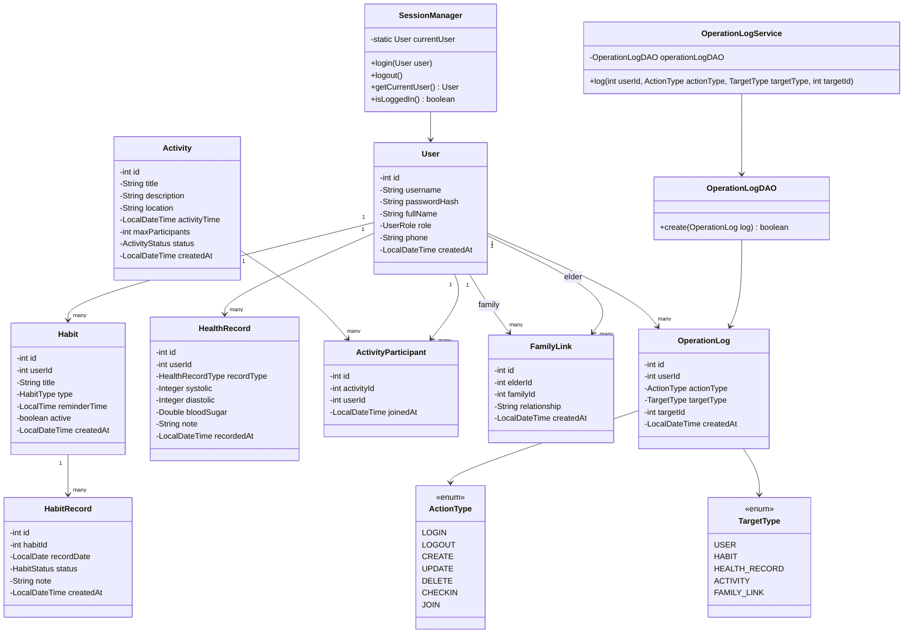
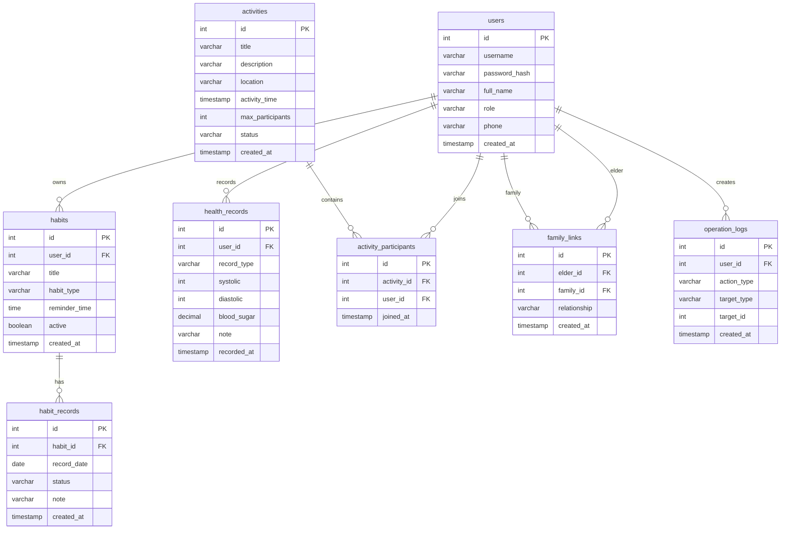
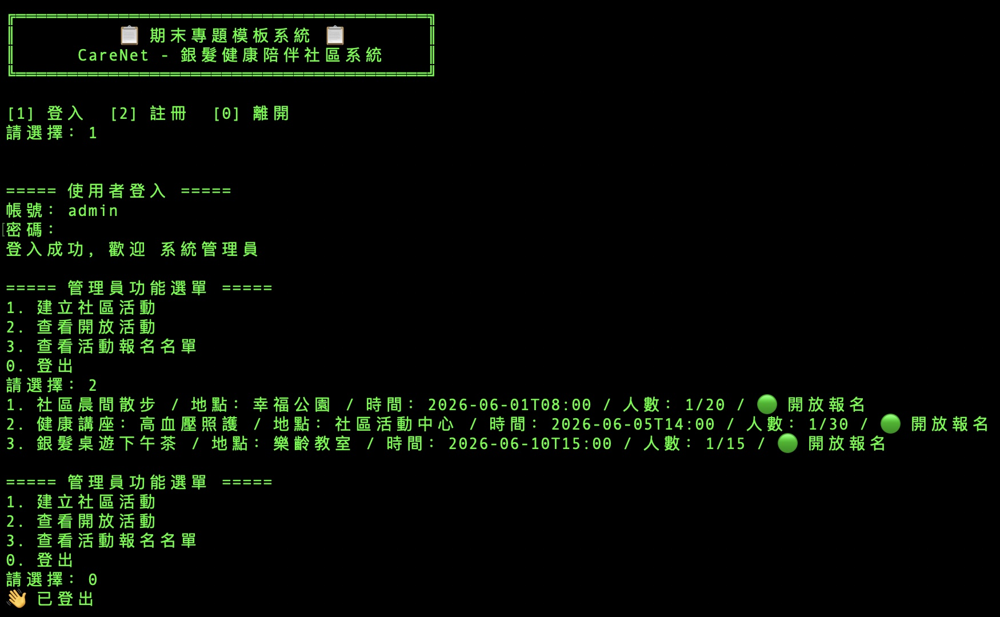
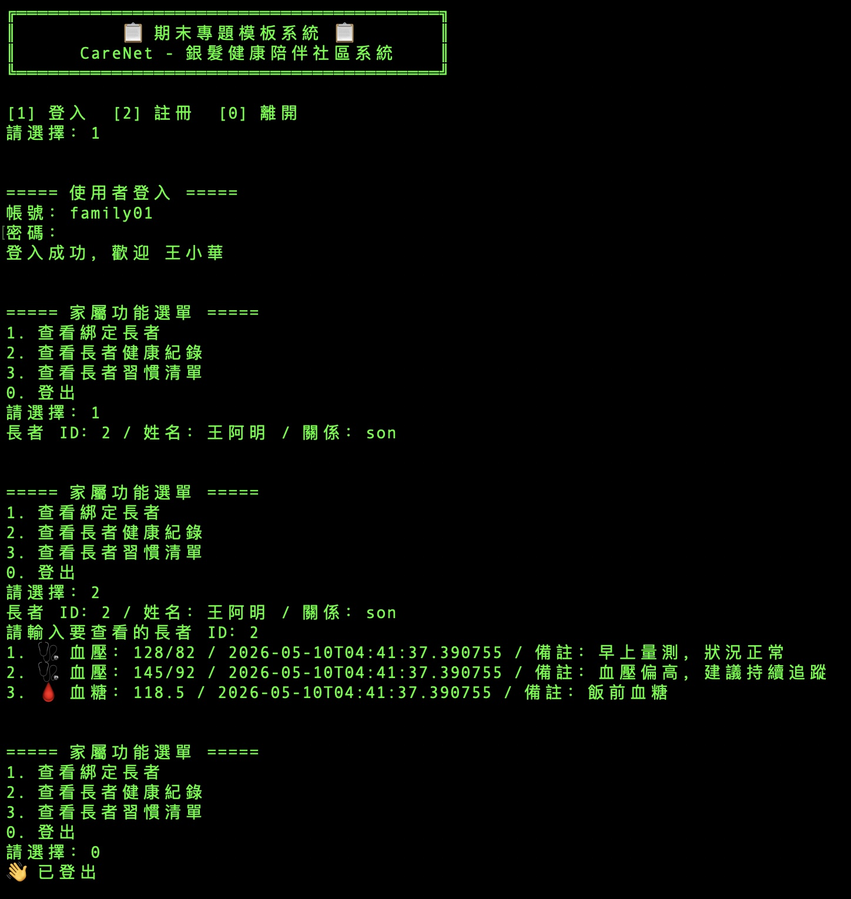

# 📋期末專題模板

> ### CareNet - 銀髮健康陪伴社區系統
>
> ### 專案簡介 
>
>CareNet 是一款以銀髮族為核心的健康陪伴社區系統。
> - 使用者登入 / 註冊
> - 習慣管理與每日打卡
> - 健康紀錄管理
> - 活動建立與報名
> - 家屬關聯
> - 操作紀錄


## 🏗️ 專案架構

```
CareNet/
├── src/main/java/com/silvercare/
│   ├── Main.java                    ← 程式入口
│   ├── config/
│   │   └── DatabaseConfig.java      ← JDBC 連線設定
│   ├── model/
│   │   ├── enums/
│   │   │   ├── ActivityStatus.java         ← 活動狀態列舉（OPEN, FULL, CANCELLED）
│   │   │   ├── HabitType.java              ← 習慣列舉（WATER, MEDICINE, WALK, SLEEP, REHAB）             
│   │   │   ├── HealthRecordType.java       ← 健康記錄列舉 (BLOOD_PRESSURE, BLOOD_SUGAR)
│   │   │   ├── UserRole.java               ← 角色列舉（ELDER, FAMILY, ADMIN）
│   │   │   ├── ActionType.java             ← 狀態列舉 (LOGIN, LOGOUT, CREATE, UPDATE, DELETE, CHECKIN, JOIN)
│   │   │   ├── TargetType.java             ← 資料處理對象列舉 (USER, HABIT, HEALTH_RECORD, ACTIVITY, FAMILY_LINK, INVALID)
│   │   │   └── HabitStatus.java            ← 狀態列舉（PENDING, COMPLETED, MISSED）
│   │   ├── User.java                       ← 使用者
│   │   ├── Activity.java                   ← 活動
│   │   ├── FamilyLink.java                 ← 親屬關係
│   │   ├── ActivityParticipant.java        ← 活動參與
│   │   ├── Habit.java                      ← 習慣
│   │   ├── HabitRecord.java                ← 習慣記錄
│   │   ├── OperationLog.java
│   │   └── HealthRecord.java               ← 健康記錄
│   ├── dao/
│   │   ├── BaseDAO.java                    ← 統一 CRUD 結構
│   │   ├── UserDAO.java                    ← 使用者 Table
│   │   ├── ActivityDAO.java                ← 活動 Table
│   │   ├── ActivityParticipantDAO.java     ← 活動參與 Table
│   │   ├── HabitDAO.java                   ← 習慣 Table
│   │   ├── HabitRecordDAO.java             ← 習慣記錄 Table
│   │   ├── HealthRecordDAO.java            ← 健康記錄 Table
│   │   ├── OperationLogDAO.java
│   │   └── FamilyLinkDAO.java              ← 親屬關係 Table
│   ├── service/
│   │   ├── ActivityService.java            ← 建立活動、報名活動
│   │   ├── AuthService.java                ← User 驗證登入、註冊、密碼處理
│   │   ├── OperationLogService.java        ← 統一操作紀錄
│   │   ├── FamilyService.java
│   │   ├── HabitService.java               ← 建立習慣、習慣阿卡、Soft Delete
│   │   └── HealthService.java              ← 血壓/血糖紀錄、異常提醒
│   ├── util/
│   │   └── SessionManager.java      ← 管理登入中的使用者 
│   └── view/
│       ├── AdminView.java           ← 管理者功能
│       ├── AuthView.java            ← 登入與註冊、切換不同 View, 記錄操作 LOGIN
│       ├── ElderView.java           ← 長者功能
│       ├── FamilyView.java          ← 親屬功能
│       └── MainView.java            ← CLI 選單（請改選單文字）
├── sql/
│   └── schema.sql                   ← 建表 + 種子資料（請改表格）
├── run.sh                           ← Mac/Linux 一鍵執行
└── run.bat                          ← Windows 一鍵執行

```

## 🚀 如何使用

### 1. 建立資料庫

```bash
# 建立 PostGreSQL 資料庫（Docker 方式）
docker run -d --name mydb -p 5432:5432 \
  -e POSTGRES_PASSWORD=postgres \
  -e POSTGRES_DB=carenet \
  postgres:16

# 匯入資料表
docker exec -i psql -U postgres -h localhost -d carenet -f sql/schema.sql
```

### 2. 編譯 & 執行

```bash
chmod +x run.sh
chmod 755 run.sh
./run.sh
```

### 3. 測試帳號

| 帳號 | 密碼 | 身份 |
|---|---|---|
| admin | admin | 管理員 |
| elder01 | 1234 | 長者 |
| family01 | 1234 | 家屬 |

## 📐 架構說明

```
View（畫面）  →  Service（邏輯）  →  DAO（資料庫）  →  PostgreSQL
  ↑ Scanner         ↑ 驗證/判斷         ↑ SQL/JDBC
  ↓ println         ↓ 回傳結果         ↓ 回傳 Model
```

### 各層職責

| 層 | 職責 | 可以做 | 不能做 |
|----|------|--------|--------|
| **View** | 使用者互動 | Scanner / println / 選單 | 寫 SQL |
| **Service** | 業務邏輯 | 驗證 / 計算 / 呼叫 DAO | 碰 Scanner |
| **DAO** | 資料存取 | SQL / JDBC / 回傳 Model | 業務判斷 |
| **Model** | 資料結構 | 屬性 / Getter / 業務方法 | 碰資料庫 |

## 📝 修改步驟（同學照做）

1. **改 package 名稱**：把 `com.template` 改成 `com.你的專題`
2. **改 Enum**：`Category` → 你的分類、`Status` → 你的狀態流程
3. **改 Model**：`Item` → 你的核心物件（例如 `Rose`、`Room`、`Bill`）
4. **改 SQL**：`schema.sql` 裡的 `items` 表改成你的資料表
5. **改 DAO**：`ItemDAO` 的 SQL 和 `mapRow()` 對應新欄位
6. **改 Service**：驗證規則改成你的業務需求
7. **改 View**：選單文字和操作流程

## 📊 類別圖（Mermaid）



## 📊 ERD（Mermaid）



---

## Demo



